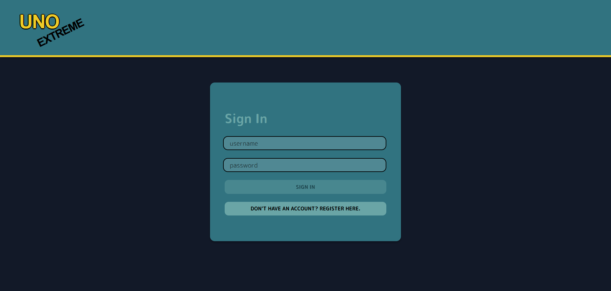
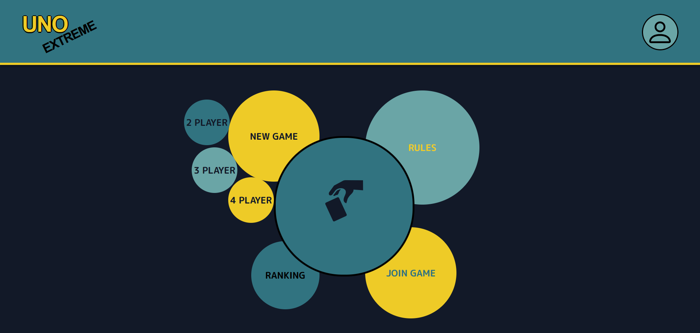
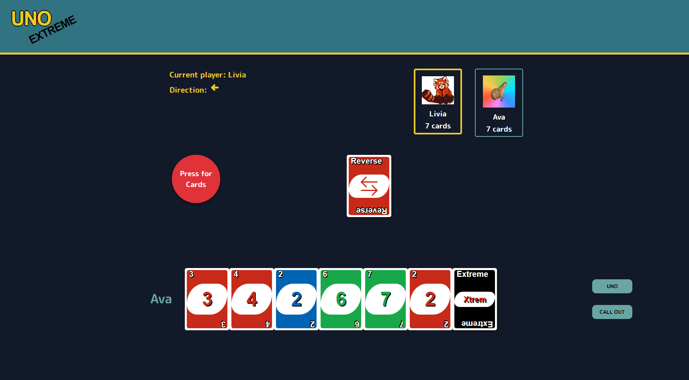

# SoPra Project Group 24 - Uno Extreme - Client

## Introduction
We are a team of 4 students at the University of Zurich.
For the course Software Engineering Lab we had to build a client-server app.  
We wanted to make a fun project and therefore we decided to implement a game.
The game we choose is the popular game Uno Extreme.

## Technologies
- React using Javascript, Styling with SCSS
- Connection to backend with REST and Websocket
- Microsoft Azure Text to Speech
- Heroku

## High Level Components
- [Dashboard](src/components/views/Dashboard.js): Overview page where a new game can be created and with links to the lobby, rules, ranking or profile.  
- [Ranking](src/components/views/Ranking.js): Gets the users from the backend with a REST request and shows the players who won the most games
- [Profile](src/components/views/Profile.js): Gets the user information from the backend and displays it. A random profile picture is already in place but the user can submit their own.
- [Lobby](src/components/views/Lobby.js): The lobby shows all the games that are already created and are still waiting for enough players. Additionally, new games can be started with a fixed number of players.
When the user joins a lobby or creates a game, they are redirected to the waitingroom. When enough players are in the waitingroom, the game automatically starts. 
- [Game](src/components/views/Game.js): Here the whole gameplay is handled. There is a connection to the backend with a websocket, which allows a quick back and forth between frontend and backend. 
The server handles the game logic. The client displays the cards, the players and updates the players via messages. After the game is finished, the user can go back to the dashboard. 


## Launch and Deployement
For your local development environment, you will need Node.js. You can download it [here](https://nodejs.org). All other dependencies, including React, get installed with:

```npm install```

Run this command before you start your application for the first time. Next, you can start the app with:

```npm run dev```

Now you can open [http://localhost:3000](http://localhost:3000) to view it in the browser.

Notice that the page will reload if you make any edits. You will also see any lint errors in the console (use Google Chrome).

### Testing
Testing is optional, and you can run the tests with `npm run test`.
This launches the test runner in an interactive watch mode. See the section about [running tests](https://facebook.github.io/create-react-app/docs/running-tests) for more information.

> For macOS user running into a 'fsevents' error: https://github.com/jest-community/vscode-jest/issues/423

### Build
Finally, `npm run build` builds the app for production to the `build` folder.<br>
It correctly bundles React in production mode and optimizes the build for the best performance: the build is minified, and the filenames include hashes.<br>

## Illustration
When going to the website, the user can either log in or go to the registration page to create a new account. 



After login/registration, the dashboard is shown where the user has the possibility to create a new game, check out the rules or the other users on the ranking page or see if there are already games running in the lobby.  
On the top right, the user has access to their profile where a profile picture can be submitted. There is already a random default profile picture set when a new profile is created.  
The rules page has a text-to-speech feature, so the rules can be listened to rather than read it yourself. 



When creating a new game, the user has to wait until enough players have joined. After that the game automatically starts.  
In the game, the user can click on the card to play it or press the launcher to get new cards.  
They get warned if they want to play a wrong card or if it is not their turn.  
They see how many card the other players have on the top right. 



After the game is finished, a popup appears, showing the winner and the user can go back to the dashboard. 

## Roadmap
Future developments could be...

- the feature to pause the game and continue at a later time
- a chat function
- a mobile version


## Authors and acknowledgment
### Authors
- Livia Stöckli
- Florian Rüegsegger
- Lea Kehrli
- Mauro Hirt

### Acknowledgment
- Kyrill Hux: Project Assistant teacher
- Thomas Fritz: Professor
- Roy Rutishauser: Head assistant teacher
## License
This project is licensed under the MIT License - see the [LICENSE.md](LICENSE.md) file for details

